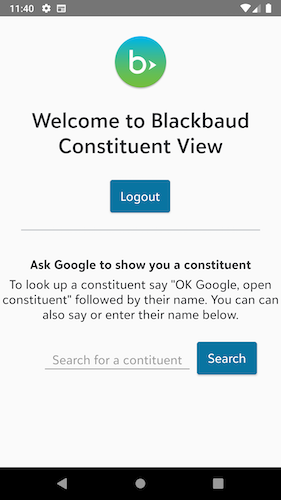
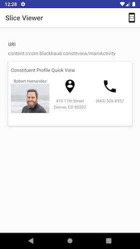

# bb-constituent-view-android

This repository contains the code for an app that demonstrates how to use the Android
Assistant with Blackbaud SKY. This is exploratory and I encountered some limitations with
what is currently possible.

This is a native Androud application written in Java and tested on API 28.

Author: [Steven Draugel](https://github.com/sdraugel)

## What it has/does

1. Adds an Android Assistant intent to look up a constituent by name - this displays a view with the profile picture, display name, address and phone number.
1. Implements Blackbaud OAuth to login, logout, and refresh the access token when expired.
1. Includes some [SKY UX](https://developer.blackbaud.com/skyux/) styling so the app look matches the site users are familiar with, and follows Blackbaud style guidelines.

[](./Screenshots/MainActivity.png)
[](./Screenshots/InAppConstitView.png)
[](./Screenshots/SliceView.png)

### Included unused code

I experimented with other available Android functionality and found that the implementation
of these pieces either did not work well or were still in developer preview.

#### `ConstiuentSliceProvider` - Android deeplink intent

I created a slice view that will integrate with the Google app, when no longer in developer preview.
This will allow a developer to display content directly in the Google app without the need for internet connectivity.

## Limitations found

These limitations exist as of Android 10 (API Level 29) and may change in the future.

### Built in intent actions.intent.OPEN_APP_FEATURE

Q: Can I open a view from an installed app using the generic built in actions.intent.OPEN_APP_FEATURE intent

A: No. There is currently a bug preventing this. ([Source](https://issuetracker.google.com/issues/135714718))

As a workaround, I created a node.js service and a custom intent that talks directly to SKY API. ([Source](Github link here))

### SKY API - server required

Because SKY API uses developer secrets for API calls, an intermediate server is
needed to conceal these secrets. That means that SKY API calls should not be made directly
from a mobile application like they are in this demo. Instead, the app should make
calls to your server and your server should make the calls to SKY API using the secrets.

## Additions wanted (contributions welcome)

1. Cover all reasonable SKY UX styling
1. Turn SKY UX styling into a Framework so other Android apps can reuse the code
1. Turn SKY API into a Framework so other Android apps can reuse the code - ideally would autogenerate this from the SKY API swagger
1. Unit tests
1. Localization
1. Accessibility
1. Proper UI for "find a constituent" - allow finding within the app

### Further exploration/nice-to-have features

1. Integration with the Google app
1. Dark mode

~~~ 
TODO: Pickup here 
~~~

## Getting started

Prerequisites:
* This app can only be compiled on a Mac computer
* An Apple Developer account is needed
    * You need to select a provisioning profile with App Groups and Siri features
    * Required to run the app on a real device or submit an app to the App Store
    * If you are building a bespoke app for a client, they may add you to their paid organization account so you don't need to purchase an Apple Developer account
* A SKY Developer account with environment access is needed to access data in SKY API
* You need Xcode installed

1. Set up your SKY application
    1. Go to [SKY Developer](https://developer.blackbaud.com/apps/) and create an application
    1. Note the application ID and secret
    1. Add a redirect URI `https://host.nxt.blackbaud.com/app-redirect/redirect-siridemo/`
    1. In file [SiriDemoAppProperties/Properties.swift](./SiriDemoAppProperties/Properties.swift), set the `SkyAppId` and `SkyAppSecret` properties to your values
        * Note that the secret is intended to be kept secret and this value should not be included in a production app
    1. Add the application to an environment
        1. Go to the home page of environment where you are an environment admin
        1. Go to Control Panel > Applications
        1. Click Add Application
        1. Enter your Application ID and click Save
1. Signing - this is necessary if you want to run the app on a physical iPhone instead of the simulator
    1. When you open the app in Xcode, click the `Siri-Demo` project (not folder) in the project navigator
    1. Click the `Siri-Demo` target
    1. Go to the Signing & Capabilities tab
    1. Choose a provisioning profile you have installed
    1. Repeat these steps with all targets
    1. Once complete, all build warnings "Capabilities for Signing & Capabilities may not function correctly because its entitlements use a placeholder team ID. To resolve this, select a development team in the ... editor." will be gone

### Debugging

To use Siri on the Simulator, you must have Ask Siri enabled in your Mac System Preferences.
When this was not enabled, the simulator would not speak at all and the Siri action in
the simulator never made any noise or listened for audio. If I tried to dictate a contact
report with this setting disabled, I would see the `AVSpeechSynthesizerDelegate` `didCancel`
method being called. After changing this setting, the simulator must be restarted.

To debug the app (code in the `Siri-Demo` folder), choose the `Siri-Demo` scheme.

To debug the intent handlers (code in the `Person` folder), choose the `Person`
scheme.

To debug the intent UI like the "find a constituent" pop up (code in the `PersonUI`
folder), choose the `PersonUI` scheme.

As far as I know, there's no way to debug more than one of these at a time. You
will not see print statements or app crash errors from the scheme you are not
currently debugging.

I saw the simulator repeatedly freeze up if I did not show the keyboard before attempting
to use the Siri Shortcuts app:
1. Open safari (or any app with a normal text field)
1. Click the text field at the top
1. Click the menu Hardware > Keyboard > Toggle Software Keyboard (or use cmd+K)
1. Ensure that the keyboard is displayed
1. You may need to do this each time you open the simulator

## Usage

This is licensed under the MIT License. Please feel free to use this app as a starting
point for your own app that is available to Blackbaud clients. Keep in mind that there
are separate limitations on using Blackbaud's logo, name, and other trademarks as
part of your App Store metadata as per Apple's and Blackbaud's terms of service.

This repository contains a proof of concept and, while it can be used as the basic for your own app,
you should review it for security best practices prior to publication. For example,
for ease of debugging, secrets and stack traces are printed to the console, which
should never be done in a production application.

### Required changes

Before publishing, you'll want to change the bundle ID, group name, etc. from `*com.blackbaud*` to your
own domain.

There are some TODOs included that should be implemented prior to releasing the app. For
example, you should store the user's access token in secure storage rather than as an app
property.

#### Secrets

For simplicity, this app communicates directly with SKY API using the SKY application secret
and subscription key. These values should never be exposed in a front end application. Instead,
you should have a secure server that makes SKY API requests, and the app should communicate
with that server.

#### OAuth

SKY OAuth requires that you use an https redirect so you'll need to
have a simple website or server redirect endpoint for your OAuth redirect url that then
redirects into your app.
If you don't change the custom URL scheme for this app from `bbsiridemo`, the website
used here (https://host.nxt.blackbaud.com/app-redirect/redirect-siridemo/) will work while
you are experimenting, but you'll want to change this prior to publishing your own app.

I'd recommend you set up [Universal Links](https://developer.apple.com/ios/universal-links/)
for your app. This will mean you don't have to use a custom URL scheme, which avoids the
requirement of a simple redirect SPA/endpoint, and it will stop Safari from asking if you want to redirect.

A server endpoint that redirects to your app would return a 302 status code with the `Location`
header set to your app URL.

Here is an example of a SKY UX Angular page that can be used to redirect back to an app:

```ts
import {
  Component, OnInit
} from '@angular/core';
import { ActivatedRoute } from '@angular/router';
import { SkyAppWindowRef } from '@skyux/core';

@Component({
  selector: 'skyapi-oauth-redirect',
  template: `<main>
  <h1>
    You've been redirected here by SKY API
  </h1>
  <p *ngIf="errorMessage">
    Error: {{ errorMessage }}
  </p>
</main>`
})
export class SkyApiOauthRedirectComponent implements OnInit {

  public errorMessage: string;

  constructor(private route: ActivatedRoute, private windowRef: SkyAppWindowRef) {
  }

  public ngOnInit() {

    this.route.queryParams.subscribe(params => {
      let code = params['code'];
      // let state = params['state']; // TODO pass `state` to the request and verify here
      this.errorMessage = params['error'];

      if (!this.errorMessage) {
        let url = `bbsiridemo://auth?code=${code}`;
        this.windowRef.nativeWindow.location.href = url;
      }
    });
  }
}
```
