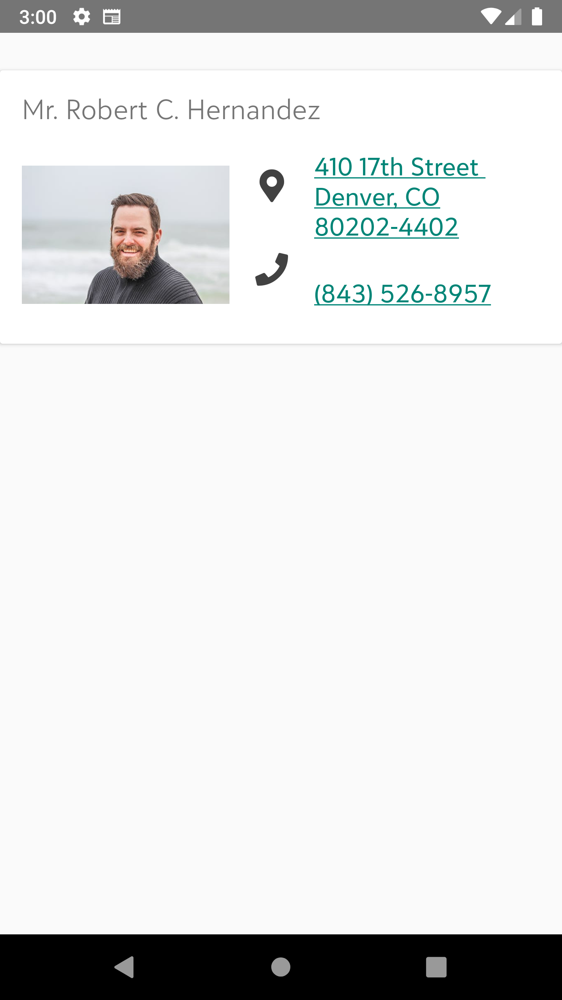
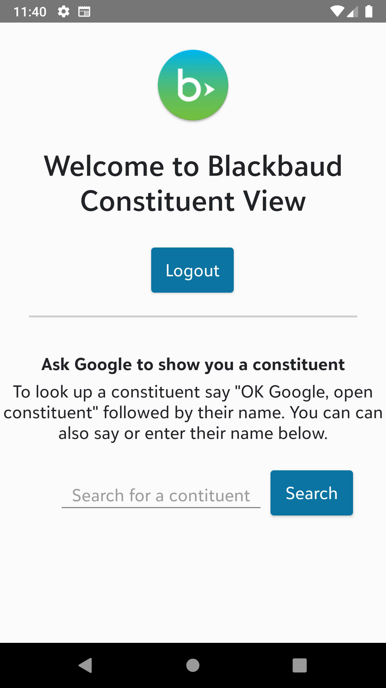

# bb-constituent-view-android

This repository contains the code for an app that demonstrates how to use the Android
Assistant with Blackbaud SKY. This is exploratory and I encountered some limitations with
what is currently possible.

This is a native Androud application written in Java and tested on API 28.

Author: [Steven Draugel](https://github.com/sdraugel)

## What it has/does

1. Adds a Android Assistant intent to look up a constituent by name - this displays a small popup with the profile picture, display name, and lookup ID.
1. Adds a slice viewer that will integrate with the Google app when supported.
1. Blackbaud OAuth login/logout, refreshes the token when expired.
1. Includes some [SKY UX](https://developer.blackbaud.com/skyux/) styling so the app look matches the site users are familiar with, and follows Blackbaud style guidelines.

[](./Screenshots/InAppConstitView500h.png)
[](./Screenshots/MainActivity500h.png)
[](./Screenshots/SliceView500h.png)

### Included unused code

I experimented with other available iOS functionality and found that the implementation
of these pieces did not work well with our application, but I are including the code
as it may be useful to others.

#### `SendMessageIntent` - "Send Message" customized system intent

I wanted to be able to look up constituent contact information using SKY API and
use the normal "send message" voice commands to send a message to the constituent.
That is the opposite of what this system intent does - this intent allows the user
to look up a contact from the phone contacts only and then uses this app to send
the message. The "start call" system intents behave the same.

#### `CreateNoteIntent` - "Create Note" customized system intent and `AddTasksIntent` -
"Add Tasks" customized system intent

I was hoping this would be an easy way to add a note or upcoming action to a constituent record.
This code is functional but there is no way to customize what Siri asks for so you
have to use the constituent name when Siri asks "what folder" the note belongs in.
I was able to make a custom intent that behaves the same but allows us to change
what Siri asks for, so she will ask for the constituent name rather than the folder
name.

#### `GetVisualCodeIntent` - "Get Visual Code" customized system intent

For those unfamiliar with this intent, it is supposed to display a QR code. We
thought this might be a good way to display something like a vCard
with constituent information, a direct link to a donation form, a direct link to
an event registration, or something similar. I was not able to get the QR code
to actually appear, and believe this may be an iOS bug. However, even if it did work,
the implementation does not support those things I was hoping for. It seems that you
can only create one QR code for an app and there are no parameters, so I couldn't
say something like "Hey Siri, give me a QR code for the upcoming gala", or "Hey Siri,
give me a QR code with Robert Hernandez's contact info". However, there's no reason
that a custom intent couldn't be written to do exactly that.

#### vCard / Virtual Contact File (VCF)

There is some code that is a start to creating a constituent vCard in the handler
for the `GetVisualCodeIntent`.

## Limitations found

These limitations exist as of iOS 13.2.3 and may change in the future.

### Apple Watch

Q: Can I tell my watch "Show me Robert Hernandez" and get a small popup with a
headshot and the most important pieces of info? Use case - I'm at a gala and I think
an MVP donor just walked in; I want to make sure it's him and brush up on his
wife's name.

A: No. "watchOS doesn’t support Intents UI app extensions" ([Source](https://developer.apple.com/documentation/sirikit/creating_an_intents_ui_extension))

As a workaround, we could do a push notification which would show up on watch,
then create a watch app where clicking the push notification would open a little
page with most important info. As I am 90% sure this is achievable, I did not
implement this for this demo.

### Dictate a contact report

I was able to create a custom Siri Shortcut in the Shortcuts app [manually](./Screenshots/DictateContactReportShortcut.png) that
did the full conversation I wanted in order to have the ideal interaction. I cannot
add this to Siri using our app. The only way to add a custom shortcut
like the one I made is for Blackbaud to publish the shortcut and us to
provide information to the users on how to install an untrusted shortcut, which is
not a simple process and could lead to security issues for non-technical users.
An example of shortcuts published in this way can be found
<a href="https://www.matthewcassinelli.com/ios-13-siri-shortcuts-library/" target="_blank">here</a>.

The functionality I was able to complete was to dictate a contact report in the app,
and then donate an interaction for dictating that is very simple. I found some issues with this:

* To dictate within the app, you can't just trigger a Siri intent, so I had to recreate the entire Siri interaction
* The default voice is not Siri's voice and sounds more like a robot. Unsure if I can get it to use Siri's voice.
* The dictation of the report stops when the user pauses and does not provide a simple way to ask if the user is done
* The donated intent does not allow you to choose "Ask Every Time" as a default so you have to pre-fill the constituent - it's unlikely someone is going to be want to add a shortcut for filing a contact report for the same constituent over and over. The user can edit this themselves but it is two clicks to even see that field.
* While the constituent lookup ID carried over to the donated intent, the recorded text did not, and I'm not sure why
* The voice recognition is not great and misheard me often

### Customized System Intents

None of the system intents available worked the way I wanted and the ones that could
be hacked to do what I wanted worked better when done as a fully custom intent. That
being said, as far as I can tell there is no benefit to using a system intent besides
that it means you don't have to build out the custom intent details yourself.
See the "Included unused code" section for more information.

### Voice interaction for finding a constituent

You cannot say "Hey Siri, show me Robert Hernandez". You have
to first trigger the shortcut like "Hey Siri, Find a constituent" and then wait
for Siri to ask who you're looking for. This is true unless you create
a shortcut for finding a specific person, where the lookup ID and/or name is pre-filled.

### Inability to default shortcut values

I cannot specify the constituent search text default value to be "Ask Each Time" when
adding the shortcut from within the app. I can only set it to a specific string or
leave it blank. This is why I added the instructions to "Specify a constituent's
name or 'Ask Each Time' by clicking 'Look up constituent' on the popup."

You can see what I mean by watching the [demo video](./Screenshots/SiriDemo-FindAConstituent.mov).

### Siri modal can't do anything complex

When using the "Find a constituent" shortcut, the only thing that can happen when
you click anywhere in the constituent preview from Siri is to open the app, and I can't detect
what was clicked apart from the constituent itself. If we wanted to do something
like let the user open directions to the address, we'd have to show the address
within the app and make that a link. This means that a) it is multiple clicks to
do something and b) it cannot be voice-only to call/text/map me to my constituent.

A workaround would be to add a shortcut for each thing that the user may want to do.
For example, add a shortcut that does the following "Hey Siri, ask Blackbaud to
map me to a constituent" "What is the name of the constituent?" "Robert Hernandez".
This shortcut would automatically open Apple Maps and navigate to the constituent address.

### Siri doesn't understand

I found that sometimes, even though I had a Siri Shortcut named exactly what I was
saying, Siri still gave suggestions unrelated to the app. For example, sometimes
when I say "Find a contact report", she will give me web results about filing reports
with government organizations. Maybe this is just a problem for developers and
there is some sort of logic in place to try something else if you keep asking the
same thing over and over again. I think the only way to determine if that's true is
to use the app like someone would normally use an app over a longer period of time.

### SKY API - server required

Because SKY API uses developer secrets for API calls, an intermediate server is
needed to conceal these secrets. That means that SKY API calls should not be made directly
from a mobile application like they are in this demo. Instead, the app should make
calls to your server and your server should make the calls to SKY API using the secrets.

## Additions wanted (contributions welcome)

1. Cover all reasonable SKY UX styling
1. Turn SKY UX styling into a Framework so other iOS apps can reuse the code
1. Turn SKY API into a Framework so other iOS apps can reuse the code - ideally would autogenerate this from the SKY API swagger
1. Unit tests
1. Localization
1. Accessibility
1. Proper UI for "find a constituent" - allow finding within the app and then donate the shortcut, rather than just having the Add to Siri button
1. Do something when "find a constituent" modal is clicked (show constituent page with useful buttons)
1. Do something after using `FileContactReportIntent` - right now just displays a blank page, maybe should open to the action
1. Complete all TODOs

### Further exploration/nice-to-have features

1. Custom intent to show a QR code containing a vCard for a constituent
1. Apple Watch app and push notifications to support Apple Watch functionality mentioned above
1. Dark mode

## Getting started

Prerequisites:
* This app can only be compiled on a Mac computer
* An Apple Developer account is needed
    * You need to select a provisioning profile with App Groups and Siri features
    * Required to run the app on a real device or submit an app to the App Store
    * If you are building a bespoke app for a client, they may add you to their paid organization account so you don't need to purchase an Apple Developer account
* A SKY Developer account with environment access is needed to access data in SKY API
* You need Xcode installed

1. Set up your SKY application
    1. Go to [SKY Developer](https://developer.blackbaud.com/apps/) and create an application
    1. Note the application ID and secret
    1. Add a redirect URI `https://host.nxt.blackbaud.com/app-redirect/redirect-siridemo/`
    1. In file [SiriDemoAppProperties/Properties.swift](./SiriDemoAppProperties/Properties.swift), set the `SkyAppId` and `SkyAppSecret` properties to your values
        * Note that the secret is intended to be kept secret and this value should not be included in a production app
    1. Add the application to an environment
        1. Go to the home page of environment where you are an environment admin
        1. Go to Control Panel > Applications
        1. Click Add Application
        1. Enter your Application ID and click Save
1. Signing - this is necessary if you want to run the app on a physical iPhone instead of the simulator
    1. When you open the app in Xcode, click the `Siri-Demo` project (not folder) in the project navigator
    1. Click the `Siri-Demo` target
    1. Go to the Signing & Capabilities tab
    1. Choose a provisioning profile you have installed
    1. Repeat these steps with all targets
    1. Once complete, all build warnings "Capabilities for Signing & Capabilities may not function correctly because its entitlements use a placeholder team ID. To resolve this, select a development team in the ... editor." will be gone

### Debugging

To use Siri on the Simulator, you must have Ask Siri enabled in your Mac System Preferences.
When this was not enabled, the simulator would not speak at all and the Siri action in
the simulator never made any noise or listened for audio. If I tried to dictate a contact
report with this setting disabled, I would see the `AVSpeechSynthesizerDelegate` `didCancel`
method being called. After changing this setting, the simulator must be restarted.

To debug the app (code in the `Siri-Demo` folder), choose the `Siri-Demo` scheme.

To debug the intent handlers (code in the `Person` folder), choose the `Person`
scheme.

To debug the intent UI like the "find a constituent" pop up (code in the `PersonUI`
folder), choose the `PersonUI` scheme.

As far as I know, there's no way to debug more than one of these at a time. You
will not see print statements or app crash errors from the scheme you are not
currently debugging.

I saw the simulator repeatedly freeze up if I did not show the keyboard before attempting
to use the Siri Shortcuts app:
1. Open safari (or any app with a normal text field)
1. Click the text field at the top
1. Click the menu Hardware > Keyboard > Toggle Software Keyboard (or use cmd+K)
1. Ensure that the keyboard is displayed
1. You may need to do this each time you open the simulator

## Usage

This is licensed under the MIT License. Please feel free to use this app as a starting
point for your own app that is available to Blackbaud clients. Keep in mind that there
are separate limitations on using Blackbaud's logo, name, and other trademarks as
part of your App Store metadata as per Apple's and Blackbaud's terms of service.

This repository contains a proof of concept and, while it can be used as the basic for your own app,
you should review it for security best practices prior to publication. For example,
for ease of debugging, secrets and stack traces are printed to the console, which
should never be done in a production application.

### Required changes

Before publishing, you'll want to change the bundle ID, group name, etc. from `*com.blackbaud*` to your
own domain.

There are some TODOs included that should be implemented prior to releasing the app. For
example, you should store the user's access token in secure storage rather than as an app
property.

#### Secrets

For simplicity, this app communicates directly with SKY API using the SKY application secret
and subscription key. These values should never be exposed in a front end application. Instead,
you should have a secure server that makes SKY API requests, and the app should communicate
with that server.

#### OAuth

SKY OAuth requires that you use an https redirect so you'll need to
have a simple website or server redirect endpoint for your OAuth redirect url that then
redirects into your app.
If you don't change the custom URL scheme for this app from `bbsiridemo`, the website
used here (https://host.nxt.blackbaud.com/app-redirect/redirect-siridemo/) will work while
you are experimenting, but you'll want to change this prior to publishing your own app.

I'd recommend you set up [Universal Links](https://developer.apple.com/ios/universal-links/)
for your app. This will mean you don't have to use a custom URL scheme, which avoids the
requirement of a simple redirect SPA/endpoint, and it will stop Safari from asking if you want to redirect.

A server endpoint that redirects to your app would return a 302 status code with the `Location`
header set to your app URL.

Here is an example of a SKY UX Angular page that can be used to redirect back to an app:

```ts
import {
  Component, OnInit
} from '@angular/core';
import { ActivatedRoute } from '@angular/router';
import { SkyAppWindowRef } from '@skyux/core';

@Component({
  selector: 'skyapi-oauth-redirect',
  template: `<main>
  <h1>
    You've been redirected here by SKY API
  </h1>
  <p *ngIf="errorMessage">
    Error: {{ errorMessage }}
  </p>
</main>`
})
export class SkyApiOauthRedirectComponent implements OnInit {

  public errorMessage: string;

  constructor(private route: ActivatedRoute, private windowRef: SkyAppWindowRef) {
  }

  public ngOnInit() {

    this.route.queryParams.subscribe(params => {
      let code = params['code'];
      // let state = params['state']; // TODO pass `state` to the request and verify here
      this.errorMessage = params['error'];

      if (!this.errorMessage) {
        let url = `bbsiridemo://auth?code=${code}`;
        this.windowRef.nativeWindow.location.href = url;
      }
    });
  }
}
```
